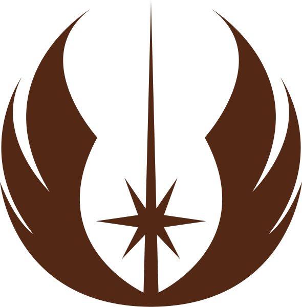

<div align="center">



<h1>Padawan Project</h1>

<p>
Project developed for Jedis of the Framework, in the selection process to try makes me a Padawan. This Project consumes a test API and displays the results filtered by user ID. ReactJS with Typescript was used, making an API call with Axios. Styled-Components were used.<p>

</div>

To run this project locally, it is necessary to have NodeJS installed on the machine.

To run on your machine, execute the command in the terminal:

```zsh
git clone https://github.com/victorradael/vulca-project.git
```

open the project folder with the command prompt and run the command:

```zsh
 npm install
```

or

```zsh
yarn
```

this done, run the command:

```zsh
npm start
```

or

```zsh
yarn start
```
